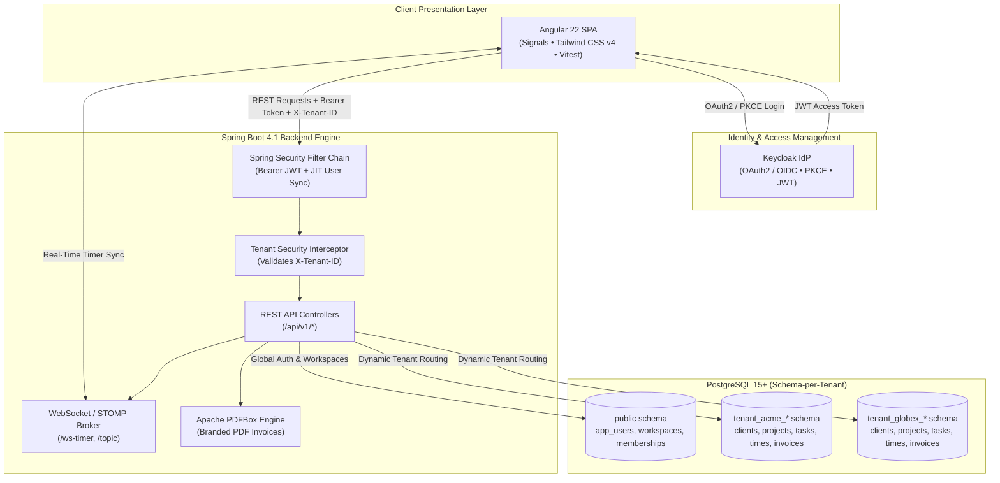

<div align="center">

# Agency OS

### The All-in-One Multi-Tenant Operating System for Modern Digital Agencies

An enterprise-grade, multi-tenant agency management platform unifying client CRM, project planning, Kanban task tracking, live stopwatch time tracking, and automated PDF invoice generation with strict database schema-level isolation.

<br/>

[](https://openjdk.org/)
[](https://spring.io/projects/spring-boot)
[](https://angular.dev/)
[](https://www.typescriptlang.org/)
[](https://www.postgresql.org/)
[](https://www.keycloak.org/)
[](https://tailwindcss.com/)
[](https://www.docker.com/)

<br/>

[Explore Repositories](#ecosystem-repositories) •
[Architecture](#system-architecture) •
[Key Features](#key-features) •
[Tech Stack](#technology-stack) •
[Quick Start](#local-development-setup) •
[Security & Multi-Tenancy](#security--multi-tenancy)

</div>

---

## About Agency OS

Agency OS streamlines everyday agency operations into a singular, cohesive workspace. It eliminates fragmented toolchains by combining customer relationship management, project budgeting, team timesheets, live stopwatch synchronization, and automated branded invoice generation under a high-security, multi-tenant architecture.

```
   ┌─────────────────┐       ┌─────────────────┐       ┌─────────────────┐
   │   Client CRM    │ ───►  │ Projects & Tasks│ ───►  │  Live Tracking  │
   │  Prospect/Active│       │  Kanban & Budget│       │Stopwatch & Logs │
   └─────────────────┘       └─────────────────┘       └─────────────────┘
                                                                │
                                                                ▼
   ┌─────────────────┐       ┌─────────────────┐       ┌─────────────────┐
   │ Workspace Sync  │ ◄───  │  Role-Based RBAC│ ◄───  │  PDF Invoicing  │
   │ Schema Isolation│       │Keycloak + OIDC  │       │Automated Billing│
   └─────────────────┘       └─────────────────┘       └─────────────────┘
```

---

## Ecosystem Repositories

| Repository | Description | Tech Stack | Status |
|---|---|---|---|
| [**front-end**](https://github.com/Agnecy-OS/front-end) | Modern SPA client with pure standalone architecture, reactive Signals, dark/light UI, and interactive demo personas. | Angular 22, TypeScript 6, Tailwind CSS v4, Signals, Vitest, STOMP | [](https://vitest.dev/) |
| [**back-end**](https://github.com/Agnecy-OS/back-end) | Enterprise REST API and real-time WebSocket server with Flyway schema-per-tenant multi-tenancy and PDF generation. | Java 21, Spring Boot 4.1, PostgreSQL, Keycloak, Apache PDFBox, JaCoCo | [](https://www.jacoco.org/) |

---

## System Architecture



---

## Key Features

### Database Schema-Level Multi-Tenancy
- Complete data isolation with dedicated PostgreSQL schemas (`tenant_<slug>_<suffix>`) provisioned automatically on workspace creation.
- Tenant context dynamically resolved via the `X-Tenant-ID` request header with strict authorization checks.

### Client CRM & Project Scoping
- Manage client lifecycles (`PROSPECT`, `ACTIVE`, `INACTIVE`), billing contacts, and notes.
- Plan fixed-budget projects, set hourly billing rates (`billingRate`), track deliverable progress, and assign client portal access.

### Interactive Task Kanban Board
- Drag-and-drop status workflows (`TODO` -> `IN_PROGRESS` -> `REVIEW` -> `DONE`).
- Task assignees, priority bands (`LOW` to `URGENT`), due dates, and real-time budget burn calculations.

### Live Stopwatch & Real-Time Synchronization
- Run browser-based stopwatches (start, pause, resume, stop) with sub-second accuracy.
- Real-time STOMP over SockJS broadcasting timer status updates across all connected teammates.

### Automated PDF Invoice Engine
- 1-click aggregation of unbilled billable hours mapped against project hourly rates.
- Generates pixel-perfect, multi-page branded PDF invoices with itemized task breakdowns using Apache PDFBox.
- Built-in in-app PDF preview modal and payment tracking (`DRAFT`, `SENT`, `PAID`, `CANCELLED`).

### Enterprise Identity & Access Control
- Integrated Keycloak OpenID Connect / OAuth2 Resource Server validation.
- Role-Based Access Control (RBAC): `OWNER`, `ADMIN`, `MEMBER`, and `CLIENT` personas with method-level `@PreAuthorize` security.

---

## Technology Stack

| Domain | Technologies & Libraries |
|---|---|
| **Front-End** | **Angular 22**, **TypeScript 6**, **Tailwind CSS v4**, Angular Signals (`signal`, `computed`, `effect`, `httpResource`), `@angular/router`, RxJS |
| **Back-End** | **Java 21 (Temurin)**, **Spring Boot 4.1**, Spring Data JPA, Hibernate, Spring Security, Spring WebSocket (STOMP), Flyway |
| **Identity & Auth** | **Keycloak OIDC**, OAuth2 Resource Server, JWT with PKCE, Spring Security SpEL Method Authorization |
| **Database** | **PostgreSQL 15+** with Schema-per-Tenant architecture |
| **Document Processing**| **Apache PDFBox 3.0** |
| **Testing & Quality** | **Vitest**, **JaCoCo (≥80% line coverage)**, **Spotless** (Google Java Format), **Checkstyle**, **SonarQube**, **ESLint**, **Prettier** |
| **DevOps & Packaging** | **Docker**, **Docker Compose**, **Jenkins CI/CD Pipeline** |

---

## Local Development Setup

### Prerequisites
- **Java 21+** (Eclipse Temurin recommended)
- **Node.js 20+** & **npm 10+**
- **PostgreSQL 15+**
- **Keycloak 24+** (configured with `agency-os` realm)
- **Docker & Docker Compose** (optional for containerized run)

---

### 1. Start Infrastructure (PostgreSQL & Keycloak)

Make sure PostgreSQL and Keycloak are up and running:
- **PostgreSQL**: `localhost:5432` (database: `agency_os`)
- **Keycloak**: `http://localhost:8080` (realm: `agency-os`, client: `agency-os-frontend` & `agency-os-backend`)

---

### 2. Back-End Setup (`back-end`)

```bash
# Clone the repository
git clone https://github.com/Agnecy-OS/back-end.git
cd back-end

# Copy and adjust environment variables
cp .env.example .env

# Run database migrations and start the server
./mvnw spring-boot:run
```

- API Base URL: `http://localhost:8080/api/v1`
- Swagger / OpenAPI Docs: `http://localhost:8080/swagger-ui.html`
- WebSocket Endpoint: `ws://localhost:8080/ws-timer`

---

### 3. Front-End Setup (`front-end`)

```bash
# Clone the repository
git clone https://github.com/Agnecy-OS/front-end.git
cd front-end

# Install dependencies
npm install

# Start the development server
npm start
```

- Web Application: `http://localhost:4200`
- Demo Showcase Personas: `http://localhost:4200/demo`

---

## Security & Multi-Tenancy

```
HTTP Request Headers:
  Authorization: Bearer <Keycloak-JWT-Token>
  X-Tenant-ID: <Tenant-Schema-Identifier>
```

| Role | Workspace Access | Client CRM | Projects & Tasks | Timesheets | Invoices |
|---|---|---|---|---|---|
| **OWNER** | Full Control, Transfer, Delete | Read / Write / Delete | Read / Write / Delete | All Users | Full Control |
| **ADMIN** | Invite / Manage Members | Read / Write / Delete | Read / Write / Delete | All Users | Full Control |
| **MEMBER** | Read Members | Read-Only | Assigned Projects/Tasks | Self Only | Read-Only |
| **CLIENT** | Limited View | Read Own Profile | Read Scoped Projects | None | View / Download Own |

---

## Testing & Quality Assurance

### Front-End Quality Gates
```bash
cd front-end
npm run test           # Vitest unit tests
npm run lint           # ESLint verification
npm run format:check   # Prettier verification
```

### Back-End Quality Gates
```bash
cd back-end
./mvnw clean test                       # Unit & integration tests
./mvnw jacoco:report                   # Coverage report (≥80% gate)
./mvnw spotless:check checkstyle:check # Code style validation
```

---

## Contributors & Maintainers

Maintained by **[Agnecy-OS](https://github.com/Agnecy-OS)**.

---

<div align="center">
  <sub>Copyright 2026 Agency OS. Built for modern high-performance agencies.</sub>
</div>
